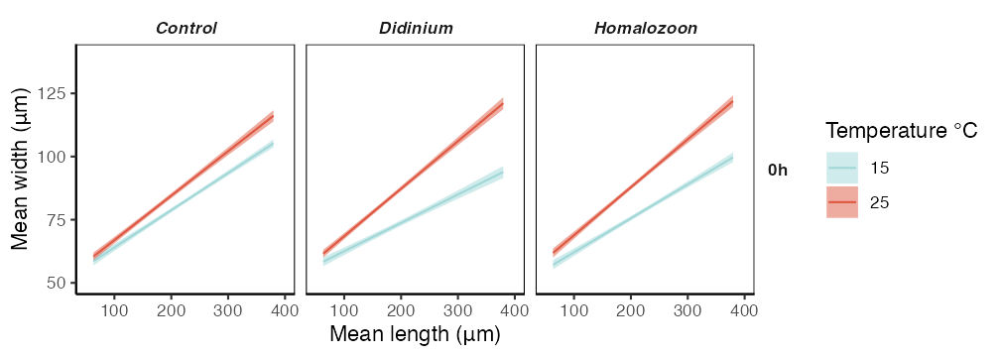

# Predator_exposure_protists_exp

Generated data, code and results from Cerini F., O’Brien DA., Wolfe E., Besson M. and Clements CF. 2023. Phenotypic response to different predator strategies can be mediated by temperature: high-resolution data from protist microcosms.

## Graphical abstract

## Repository layout
[*Code*](Code) - R scripts for generating analyses and manuscript figures (separate script files for each figure).

[*Data*](Data) - raw and processed protist data.

[*Results*](Results) - rendered fitted models, manuscript figures and supplementary information.

## Funding

This project was supported by NERC grants awarded to CF Clements ([**NE/T006579/1**](https://gtr.ukri.org/project/C57870FC-7D15-455D-BEB4-0122A44D9C43) and [**NE/T003502/1**](https://gtr.ukri.org/projects?ref=NE%2FT003502%2F1)).
